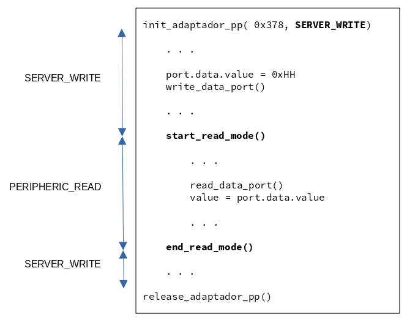
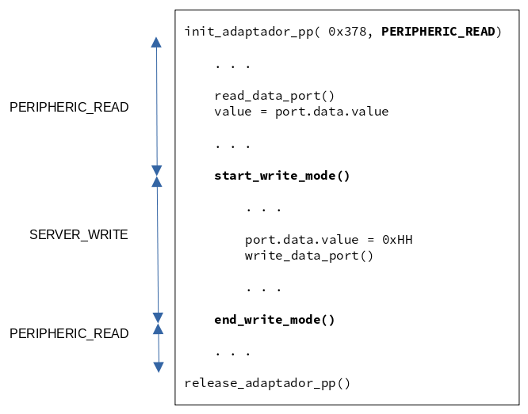

# Parallel Port Driver

- It provides a customizable communication interface between a external device and a server control program using the parallel port.
- This driver is bulid for controlling a general purpose hardware driver. This hardware driver can be useful for communicating and controlling different peripheral 
  - It provides protection and isolation of the parallel port
  - It provides capability for managing peripherals with different voltage levels
  - It provides a well defined software interface for communication betwwen server software and a slave peripheral device.

# Modules

- puerto_paralelo
- adaptador_pp
- programming_info


# Puerto_Paralelo

This module provides write and read access to a physical parallel port

- Provides a data structure with bit fields to simplify read / write operations
- Provides only the allowed write and read operations to specific port registers


### Data Structures

```
struct PuertoParalelo {
	baseAddress	: uint
	data   		: bits[D0..D7]
	status  	: bits[S3..S7]
	control 	: bits[C0..C3, C5]
}
```

### Variables

```
extern PuertoParalelo port
extern FILE*          log_file
```

### Methods

```
init_puerto_paralelo( baseAddr)	: int		// gain access to the physical port 
											// inits port structure 

write_data_port()				: void      // pp[data_addr]  <-- port.data
read_data_port()				: void		// port.data      <-- pp[data_addr]

read_status_port()				: void		// port.status    <-- pp[status_addr]
write_control_port()			: void      // pp[ctrl_addr]  <-- port.control

print_registros()				: void		// log_file.append( port ) 

release_puerto_paralelo()		: int		// release access to the physical port
```


## Usage

- **port** variable holds the information that:
  
  - Will be written to the **data** and **control** registers of the physical port
  - Have been read from the **data** and **status** registers of the physical port
  
- **port.data**, **port.status**, and **port.control** members can be set or read as a whole o as individual bits

- **data**, **status** and **control** registers of the physical port won't be updated nor read until the corresponding write or read method is invoked

- **log_file** can be initialized to a normal file, when NULL, status messages will be send to standard output

  

```
// 0. config log file

log_file = file descriptor / NULL (standard output)

// 1.  inits the port variable

init_puerto_paralelo( 0x378);
	
	//
	// 2. write / read information to and from the physical port
	//
	
	// a) update port.data / port.control and write to the physical port
	port.data.value = HH;
	write_data_port();
	
	port.control.bits.C0 = 1;
	write_control_port();
	
	... print_registros();
	
	// b) read data / status register of the physical port and chek its value
	read_data_port();
	data = port.data.value;
	
	read_status_port()
	flag = port.status.S3;
	
// 3. when done, release the port

release_puerto_paralelo();

```


## Tests

### 01_puerto_paralelo.test

- Writes to data and control registers.
- Prints information to ./test_log_file.log

### 02_max_toggle_speed.test

- Configure data lines as outputs (C3 = 1, C5 = 0)
- Toggles D4  in an infinite loop
- Prints information to standard output git
- Ctrl + C (kill signal) must be used to finish the program
- The maximum toggle speed for the LG laptop is  Fmax = 400 kHz (Tmin = 2.5 us)

# Adaptador_PP

- This module allows a **server software** to communicate with an external **peripheral device** by controlling when each of them can read from or write information into the parallel port.
  - Bit C5  of the control port determine the direction of data register of the physical parallel port. This bit, however can not be read from an external peripheral device
  - Bit C3 of the control port is used to notify an external device either to read from or write into the parallel port


### Operation Modes

| Mode            | C5   | C3   | Server Software                       | Peripheral Device                         |
| --------------- | ---- | ---- | ------------------------------------- | ----------------------------------------- |
| SERVER_WRITE    | 0    | 1    | **Writes** information into data port | Reads information from the parallel port  |
| PERIPHERIC_READ | 1    | 0    | **Reads** information from data port  | Writes information into the parallel port |


### Enumerations

```
enum Modo_Operacion_Adaptador( PERIPHIC_READ, SERVER_WRITE)
```

### Methods

```
init_adaptador_pp( baseAddr, mode)		: int		// gain access to the physical port 
													// inits port structure 

start_write_mode()						: void      
end_write_mode()						: void		

start_read_mode()						: void		
end_read_mode()							: void      

release_adaptador_pp()					: int		// release access to the physical port
```


## Usage

- Server software starts the parallel port adapter indicating the default operation mode
  - It works according the operation mode 
  - At any time, it can toggle the operation mode
- Server software releases the parallel port adapter


### SERVER_WRITE Mode




### PERIPHERIC_READ Mode




## Tests

### 01_pp_adapter.test

- For each operation mode 
  - Inits adapter
  - Starts read mode, print port registers, ends read mode and print registers
  - Starts write mode, print port registers, ends write mode and print registers
  - Releases adapter


