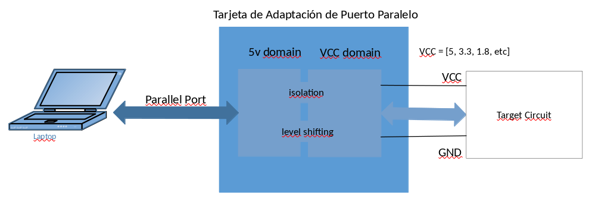
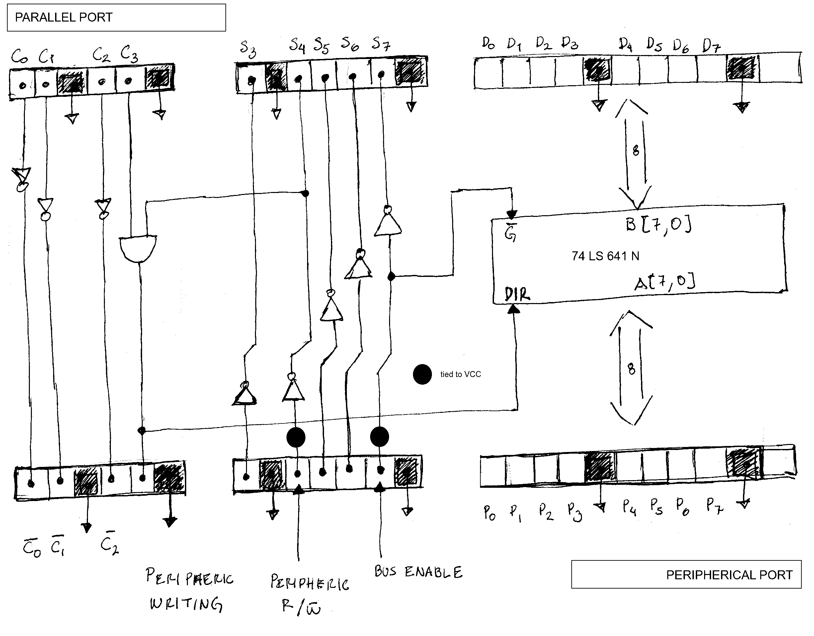
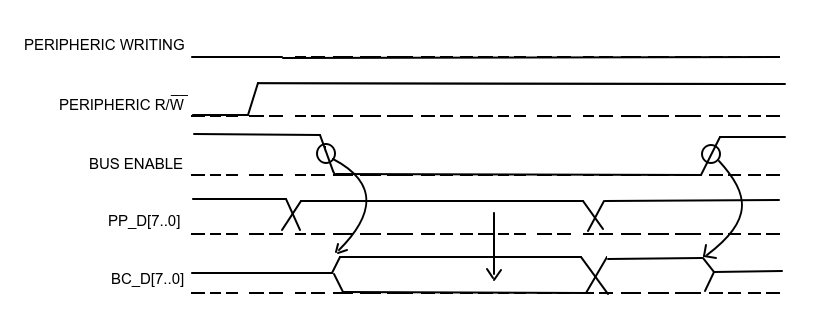
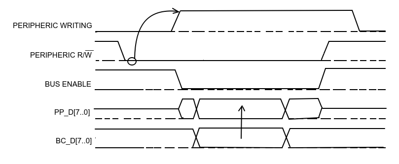

# Parallel Port Adapter Card

## Objectives

- Take advantage of the parallel port available in kind of old computers to interface with simple electronic projects
- To provide isolation and voltage level independence

## Parallel Port Interface

| Signals        | Direction      | Comment                                          |
| -------------- | -------------- | ------------------------------------------------ |
| PP_D7 .. PP_D0 | Input / Output | Bidirectional data port connected to DATA lines  |
| PP_C3 .. PP_C0 | Input          | Inputs to the PP adapter card from CONTROL lines |
| PP_S7 .. PP_S3 | Output         | Outputs from the PP adapter to the STATUS lines  |

## Peripheral Interface

| Signals          | Direction      | Comment                                                      |
| ---------------- | -------------- | ------------------------------------------------------------ |
| BC_D7 .. BC_D0   | Input / Output | Bidirectional data port                                      |
| BC_C2N .. BC_C0N | Output         | Inverted outputs from the corresponding CONTROL lines        |
| BC_S3N,S5N,S6N   | Input          | Inverted inputs to the corresponding STATUS lines            |
| PRPHRC_WRITE     | Output         | Peripheral Data Bus Write Control  1 => allows a peripheral device to write into the data bus of the card 0 => a peripheral device must read data from the card |
| PRPHRC_RWN       | Input          | Peripheral Data Bus Request 0 => Request to the server to read data from the peripheral   Peripheral device can write data into the card's data bus until the PRPHRC_WRITE lines goes to 1. |
| BUS_ENABLE       | Input          | 1 => Card's data bus is isolated                             |

## 74LS641

- Bidirectional bus drivers with not inverted, open-collector outputs
- Icc = 100 mA

| G_NEG | DIR  | Function        |
| ----- | ---- | --------------- |
| 0     | 0    | B data to A bus |
| 0     | 1    | A data to B bus |
| 1     | X    | Isolation       |

​    

## General Function

| PP_C3 | PRPHRC_RWN | BUS_ENABLE | PRPHR_WRITE | Function                  |
| :---: | :--------: | :--------: | :---------: | ------------------------- |
|   0   |     0      |     0      |    [ 0 ]    | [ PP data to PRPHRC bus ] |
|   0   |     0      |     1      |    [ 0 ]    | [ Isolation ]             |
|   0   |     1      |     0      |    [ 0 ]    | [ PP data to PRPHRC bus ] |
|   0   |     1      |     1      |    [ 0 ]    | [ Isolation ]             |
|   1   |     0      |     0      |    [ 1 ]    | [ PRPHRC data to PP bus ] |
|   1   |     0      |     1      |    [ 1 ]    | [ Isolation ]             |
|   1   |     1      |     0      |    [ 0 ]    | [ PP data to PRPHRC bus ] |
|   1   |     1      |     1      |    [ 0 ]    | [ Isolation ]             |

| BUS_ENABLE | PRPHRC_WRITE | Function              | Comments                    |
| :--------: | :----------: | --------------------- | --------------------------- |
|     0      |      0       | PP data to PRPHRC bus | Server writes to peripheric |
|     0      |      1       | PRPHRC data to PP bus | Server read from peripheric |
|     1      |      X       | Isolation             | Ports are isolated          |

## Operation Modes

## Server  Write

|  #   | SERVER                                                       | PERIPHERAL                                                   |
| :--: | ------------------------------------------------------------ | ------------------------------------------------------------ |
|  1   | Keeps **PERIPHERIC_WRITING** low                             |                                                              |
|  2   |                                                              | Keeps  **PERIPHERIC_RWN** high Drives **BUS_ENABLE** low |
|  3   | Set data lines **(*)** Manages signaling using Control outputs |                                                              |
|  4   |                                                              | Read data **(*)** Acknowledges using Status inputs      |

**(*) NOTE: ** Signaling depends on server driver and external peripheral

## Peripheral Read

|  #   | SERVER                                                    | PERIPHERAL                                                   |
| :--: | --------------------------------------------------------- | ------------------------------------------------------------ |
|  1   |                                                           | Drives **PERIPHERIC_RWN** low                                |
|  2   | Rises **PERIPHERIC_WRITING**                              |                                                              |
|  3   |                                                           | Drives **BUS_ENABLE** low Drives Data inputs **(*)** Manages signaling using Status inputs |
|  4   | Read data **(*)** Acknowledges using Control outputs |                                                              |

**(*) NOTE: ** Signaling depends on server driver and external periphera

